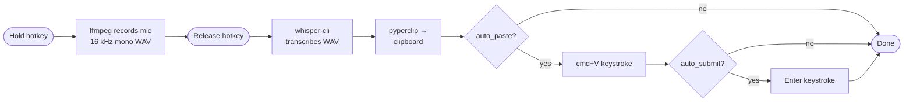

# laptop-dictation

[](https://github.com/CasterlyGit/laptop-dictation/actions/workflows/ci.yml)
[](LICENSE)
[](https://www.python.org/downloads/)

**Hold a hotkey, speak, release — local Whisper.cpp transcribes in ~250 ms and puts the text straight into your clipboard (or pastes and submits it for you). No cloud, no API key, no five-second timeout.**

**Status:** v0.2 — push-to-talk daemon + auto-submit into the focused app. Runs on macOS (Apple Silicon + Intel). Linux is best-effort.

**[▶ Live demo](https://casterlygit.github.io/laptop-dictation/)** — hold the mic button, see a live waveform, release for a transcribed result in a clipboard-style box.

---

## Why this exists

macOS's built-in dictation mangles "Claude", "MCP", and mixed-case names, enforces a 60-second hard cutoff, and reformats text mid-sentence. push-to-talk with a local Whisper model fixes all three:

1. **Push-to-talk** — hold a key, speak, release. No trigger phrase, no timeout mid-thought.
2. **Local** — Whisper.cpp on your own machine. ~250 ms for a 5-second clip on M2.
3. **Works in any app** — text lands on your clipboard; `cmd+V` works everywhere.
4. **Technical vocab** — Whisper-small or medium handles programming jargon and proper nouns far better than built-in dictation.

---

## Architecture



- **Hotkey**: global listener via `pynput`. Default: Right Option. Configurable in `~/.config/laptop-dictation/config.toml`.
- **Recording**: ffmpeg (AVFoundation on macOS, ALSA on Linux). Outputs 16 kHz mono WAV — the format Whisper expects.
- **Transcription**: pluggable. Default is `whisper.cpp` running locally (~250 ms/5-second clip on M2). OpenAI Whisper API is a fallback.
- **Output**: clipboard by default. With `auto_paste = true` it also types `cmd+V`. With `auto_submit = true` it presses Enter too — making dictation a full voice interface for Claude Code or any chat box.

---

## Setup

```bash
# 1. Clone + install deps
git clone https://github.com/CasterlyGit/laptop-dictation.git
cd laptop-dictation
./scripts/setup.sh              # installs ffmpeg + whisper.cpp + Python deps + small model

# 2. macOS: grant Accessibility + Microphone permissions
#    System Settings → Privacy & Security → Accessibility / Microphone
#    Add your terminal app

# 3. First-run config (writes ~/.config/laptop-dictation/config.toml)
dictate init

# 4. Test it
dictate once                    # records 5 seconds, transcribes, copies to clipboard

# 5. Start the daemon
dictate listen                  # hold Right Option to record; ctrl-c to stop
```

---

## Usage

```bash
# Daemon mode — hold Right Option, talk, release. Text lands on clipboard.
dictate listen

# One-shot — useful for testing or scripting
dictate once --seconds 10

# Override the model on the fly
dictate listen --model medium

# Use OpenAI Whisper API instead of local whisper.cpp
dictate listen --backend openai

# Show your current config
dictate config

# Verify everything is wired up
dictate doctor
```

---

## Config file

`~/.config/laptop-dictation/config.toml`:

```toml
[hotkey]
key = "alt_r"          # pynput key name; e.g. "alt_r", "ctrl_r", "f9"

[recording]
sample_rate = 16000
device = "default"     # macOS: "AVFoundation default", or device index

[transcription]
backend = "whisper-cpp"   # whisper-cpp | openai
model = "small"           # tiny | base | small | medium | large
language = "en"           # ISO code; "auto" for detection

[output]
copy_to_clipboard = true
auto_paste = false        # also send cmd+V after copying
auto_submit = false       # press Enter after paste (great for Claude Code / chat boxes)
submit_delay_ms = 40      # gap between paste and Enter

[paths]
whisper_cpp = "/opt/homebrew/bin/whisper-cli"
models_dir = "~/.cache/whisper-cpp"
```

### Voice-driving Claude Code (or any chat box)

Enable both flags and pick a hotkey that doesn't conflict with your editor:

```toml
[hotkey]
key = "alt_r"             # hold right-option to talk

[output]
copy_to_clipboard = true
auto_paste = true
auto_submit = true
```

Focus the Claude chat box in VSCode → hold right-option → speak → release → message appears and sends. No keyboard, no clicks.

**Mac note:** available hold-keys are `alt_r` / `alt_l` (Option), `ctrl_r` / `ctrl_l`, `cmd_r` / `cmd_l`, or function keys like `f9`. Pick one your editor doesn't capture.

---

## Models

| Model  | Size   | Speed (M2)    | Notes                                      |
|--------|--------|---------------|--------------------------------------------|
| tiny   | 75 MB  | ~100 ms/5 s   | Fastest; OK for clear speech               |
| base   | 142 MB | ~150 ms/5 s   | Noticeably better on technical words       |
| small  | 466 MB | ~250 ms/5 s   | **Default.** Good balance for most uses    |
| medium | 1.5 GB | ~500 ms/5 s   | Best for programming / Claude vocabulary   |
| large  | 3 GB   | ~900 ms/5 s   | Marginal gain over medium; slowest         |

The setup script downloads `small` by default. To switch:

```bash
dictate model download medium
```

---

## Roadmap

- [ ] Direct Claude Code integration (auto-paste into the active terminal)
- [ ] Inline punctuation (whisper.cpp doesn't add commas reliably for streamed audio)
- [ ] Menu bar icon showing REC state
- [ ] Windows support
- [ ] Streaming transcription (start writing before you stop talking)

---

## Live demo

[casterlygit.github.io/laptop-dictation](https://casterlygit.github.io/laptop-dictation/) — interactive: hold the mic button, see a live waveform, release for a transcribed result in a clipboard-style box.

---

## Companion projects

- [curby](https://github.com/CasterlyGit/curby) — voice + gesture macOS controller; uses dictation for spoken commands
- [hand-signal](https://github.com/CasterlyGit/hand-signal) — gesture recognition layer that pairs with voice input
- [emergency-ai](https://github.com/CasterlyGit/emergency-ai) — offline AI triage tool; shares the recording + transcription layer

---

## License

MIT — see [LICENSE](LICENSE).
