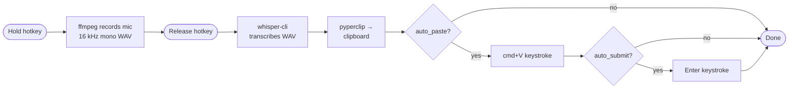

# laptop-dictation

[](https://github.com/CasterlyGit/laptop-dictation/actions/workflows/ci.yml)
[](LICENSE)
[](https://www.python.org/downloads/)

**Hold a hotkey, speak, release — local Whisper.cpp transcribes in ~250 ms and puts the text straight into your clipboard (or pastes and submits it for you). No cloud, no API key, no five-second timeout.**

**Status:** v0.4 — Wispr-Flow-style insertion: hold `ctrl+3`, speak, release — the text lands wherever your cursor is. Works on macOS (Apple Silicon, Intel). Linux is best-effort.

**[▶ Live demo](https://casterlygit.github.io/laptop-dictation/)** — hold the mic button, see a live waveform, release for a transcribed result in a clipboard-style box.

> **New in v0.4:** **system-wide key suppression** for chord hotkeys. Terminals map `ctrl+3` → ESC — which would interrupt a running Claude Code session. The daemon now swallows the chord's non-modifier keys at the Quartz event-tap level while push-to-talk is held, so nothing leaks into the focused app. Plus: transcription moved off the event-tap thread (keyboard can never freeze), a `min_hold_ms` accidental-tap guard, sound cues, and whisper vocab `prompt` + greedy `beam_size` for ~2× faster CPU decoding.
>
> **v0.3:** chord hotkeys like `ctrl+shift+l`. Hold all the keys at once to record, release any one to stop. Combine with `auto_paste` + `auto_submit` for a true voice interface to Claude Code / any chat box.

---

## Why this exists

macOS's built-in dictation mangles "Claude", "MCP", and mixed-case names, enforces a 60-second hard cutoff, and reformats text mid-sentence. push-to-talk with a local Whisper model fixes all three:

1. **Push-to-talk** — hold a key, speak, release. No trigger phrase, no timeout mid-thought.
2. **Local** — Whisper.cpp on your own machine. ~250 ms for a 5-second clip on M2.
3. **Works in any app** — text lands on your clipboard; `cmd+V` works everywhere.
4. **Technical vocab** — Whisper-small or medium handles programming jargon and proper nouns far better than built-in dictation.

---

## Architecture


```mermaid
flowchart LR
    A([Hold hotkey]) --> B[ffmpeg records mic\n16 kHz mono WAV]
    B --> C([Release hotkey])
    C --> D[whisper-cli\ntranscribes WAV]
    D --> E[pyperclip →\nclipboard]
    E --> F{auto_paste?}
    F -- yes --> G[cmd+V keystroke]
    G --> H{auto_submit?}
    H -- yes --> I[Enter keystroke]
    F -- no --> J([Done])
    H -- no --> J
    I --> J
```

- **Hotkey**: global listener via `pynput`. Default: Right Option. Configurable in `~/.config/laptop-dictation/config.toml`.
- **Recording**: ffmpeg (AVFoundation on macOS, ALSA on Linux). Outputs 16 kHz mono WAV — the format Whisper expects.
- **Transcription**: pluggable. Default is `whisper.cpp` running locally (~250 ms/5-second clip on M2). OpenAI Whisper API is a fallback.
- **Output**: clipboard by default. With `auto_paste = true` it also types `cmd+V`. With `auto_submit = true` it presses Enter too — making dictation a full voice interface for Claude Code or any chat box.

---

## Setup

```bash
# 1. Clone + install deps
git clone https://github.com/CasterlyGit/laptop-dictation.git
cd laptop-dictation
./scripts/setup.sh              # installs ffmpeg + whisper.cpp + Python deps + small model

# 2. macOS: grant Accessibility + Microphone permissions
#    System Settings → Privacy & Security → Accessibility / Microphone
#    Add your terminal app

# 3. First-run config (writes ~/.config/laptop-dictation/config.toml)
dictate init

# 4. Test it
dictate once                    # records 5 seconds, transcribes, copies to clipboard

# 5. Start the daemon
dictate listen                  # hold Right Option to record; ctrl-c to stop
```

### Always-on daemon (macOS): spawn from your terminal, not launchd

macOS TCC attributes Accessibility/Input-Monitoring/Microphone to the daemon's
*responsible process*. Launched from a terminal you've already granted
(Terminal, iTerm, VS Code), everything works. Launched from launchd via an
ad-hoc-signed wrapper app, the System Settings toggles show ON but are **not
honored** — the active tap and synthetic paste silently fail. The reliable
pattern is a tiny idempotent hook in `~/.zshrc`:

```sh
case "$TERM_PROGRAM" in
  Apple_Terminal|iTerm.app|vscode)
    (~/.local/share/laptop-dictation/ensure-daemon.sh >/dev/null 2>&1 &)
    ;;
esac
```

See `scripts/ensure-daemon.sh`. The daemon detaches (survives the shell) and
self-heals on every new terminal window — including the first one after a
reboot.

---

## Usage

```bash
# Daemon mode — hold Right Option, talk, release. Text lands on clipboard.
dictate listen

# One-shot — useful for testing or scripting
dictate once --seconds 10

# Override the model on the fly
dictate listen --model medium

# Use OpenAI Whisper API instead of local whisper.cpp
dictate listen --backend openai

# Show your current config
dictate config

# Verify everything is wired up
dictate doctor
```

---

## Config file

`~/.config/laptop-dictation/config.toml`:

```toml
[hotkey]
key = "ctrl+3"         # single key (pynput name) — e.g. "alt_r", "ctrl_r", "f9"
                       # or a chord with "+": "ctrl+3", "ctrl+shift+l", "cmd+opt+space"
min_hold_ms = 250      # discard recordings shorter than this (accidental taps)

[recording]
sample_rate = 16000
device = "default"     # macOS: "AVFoundation default", or device index

[transcription]
backend = "whisper-cpp"   # whisper-cpp | openai
model = "small"           # tiny | base | small | medium | large (.en variants: faster, English-only)
language = "en"           # ISO code; "auto" for detection
beam_size = 0             # 1 = greedy decode (~2x faster on CPU); 0 = engine default
prompt = ""               # vocabulary bias, e.g. "Claude Code, pytest, MCP" — fixes jargon misses

[output]
copy_to_clipboard = true
auto_paste = false        # also send cmd+V after copying — text lands at the cursor
auto_submit = false       # press Enter after paste (great for Claude Code / chat boxes)
submit_delay_ms = 40      # gap between paste and Enter
sound_cues = false        # Pop on REC start, Basso on failure (headless REC feedback)
preserve_clipboard = false # restore the previous clipboard after auto-paste

[paths]
whisper_cpp = "/opt/homebrew/bin/whisper-cli"
models_dir = "~/.cache/whisper-cpp"
```

### Picking a model for your hardware

Whisper latency is what makes dictation feel instant or broken. Measured on an
Intel i5-1038NG7 (2020 13" MBP) with an 8-second utterance:

| model · settings | wall time | verdict |
|---|---|---|
| `small`, defaults | ~28 s | unusable on Intel |
| `base.en`, `beam_size = 1` | ~9.5 s | borderline |
| `tiny.en`, `beam_size = 1` + vocab `prompt` | **~3 s** | ships — jargon stays correct via the prompt |

On Apple Silicon, `small` runs ~10× faster and is the better default. The vocab
`prompt` is the cheap accuracy lever: `tiny.en` alone wrote "pie test"; with
`prompt = "Claude Code, pytest, …"` it writes "pytest".

### Voice-driving Claude Code (or any chat box)

Enable both flags and pick a hotkey that doesn't conflict with your editor:

```toml
[hotkey]
key = "alt_r"             # hold right-option to talk

[output]
copy_to_clipboard = true
auto_paste = true
auto_submit = true
```

Focus the Claude chat box in VSCode → hold right-option → speak → release → message appears and sends. No keyboard, no clicks.

**Mac note:** available hold-keys are `alt_r` / `alt_l` (Option), `ctrl_r` / `ctrl_l`, `cmd_r` / `cmd_l`, or function keys like `f9`. Pick one your editor doesn't capture.

---

### Chord hotkeys (v0.3+)

Combine modifiers with `+` to require multiple keys held simultaneously:

```toml
[hotkey]
key = "ctrl+shift+l"   # hold all three at once to record; release any to stop
```

Generic modifier names (`ctrl`, `shift`, `alt`/`opt`, `cmd`) accept either left or right variant. Use a specific variant (`shift_r`, `alt_l`) to pin one side. Aliases: `option`→`alt`, `command`/`meta`/`super`→`cmd`.

## Models

| Model  | Size   | Speed (M2)    | Notes                                      |
|--------|--------|---------------|--------------------------------------------|
| tiny   | 75 MB  | ~100 ms/5 s   | Fastest; OK for clear speech               |
| base   | 142 MB | ~150 ms/5 s   | Noticeably better on technical words       |
| small  | 466 MB | ~250 ms/5 s   | **Default.** Good balance for most uses    |
| medium | 1.5 GB | ~500 ms/5 s   | Best for programming / Claude vocabulary   |
| large  | 3 GB   | ~900 ms/5 s   | Marginal gain over medium; slowest         |

The setup script downloads `small` by default. To switch:

```bash
dictate model download medium
```

---

## Roadmap

- [x] Direct Claude Code integration — `ctrl+3` pastes into the active terminal, ESC suppressed (v0.4)
- [ ] Inline punctuation (whisper.cpp doesn't add commas reliably for streamed audio)
- [ ] Menu bar icon showing REC state (sound cues shipped in v0.4)
- [ ] Windows support
- [ ] Streaming transcription (start writing before you stop talking)

---

## Live demo

[casterlygit.github.io/laptop-dictation](https://casterlygit.github.io/laptop-dictation/) — interactive: hold the mic button, see a live waveform, release for a transcribed result in a clipboard-style box.

---

## Companion projects

- [curby](https://github.com/CasterlyGit/curby) — voice + gesture macOS controller; uses dictation for spoken commands
- [hand-signal](https://github.com/CasterlyGit/hand-signal) — gesture recognition layer that pairs with voice input
- [emergency-ai](https://github.com/CasterlyGit/emergency-ai) — offline AI triage tool; shares the recording + transcription layer

---

## License

MIT — see [LICENSE](LICENSE).
